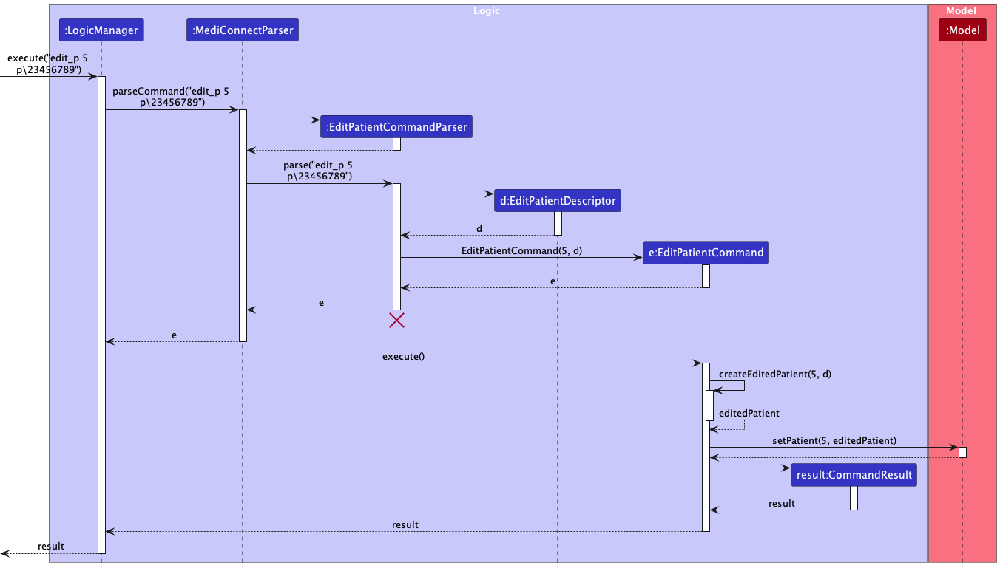
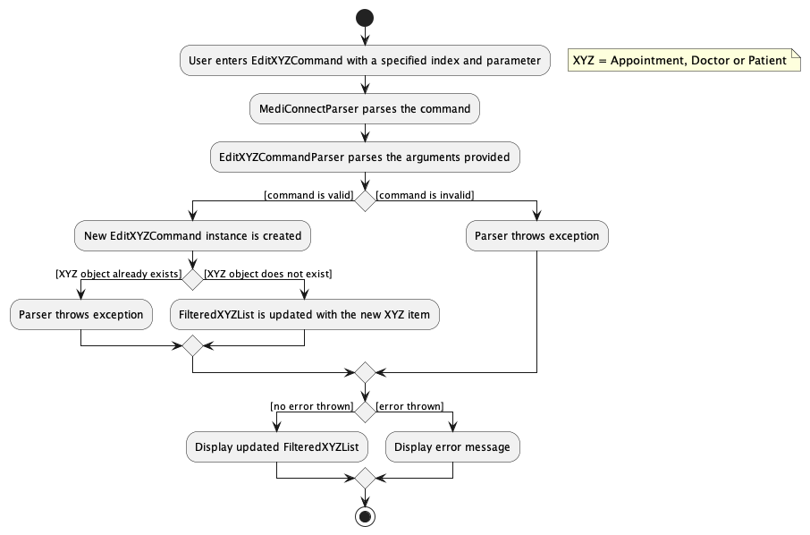
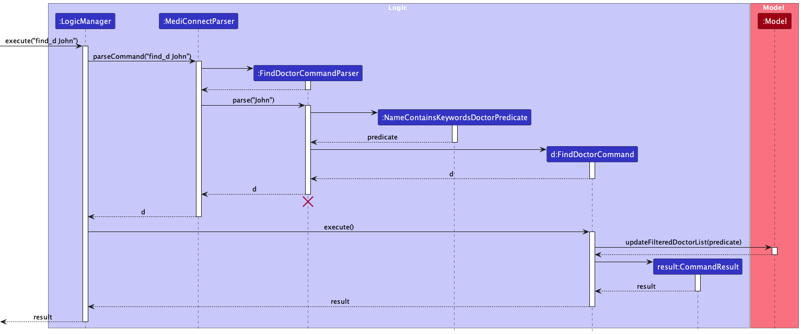
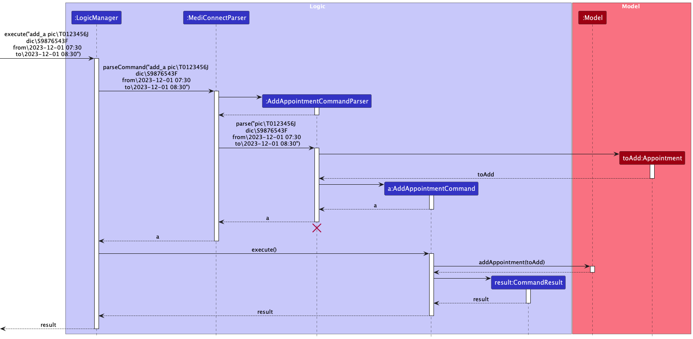
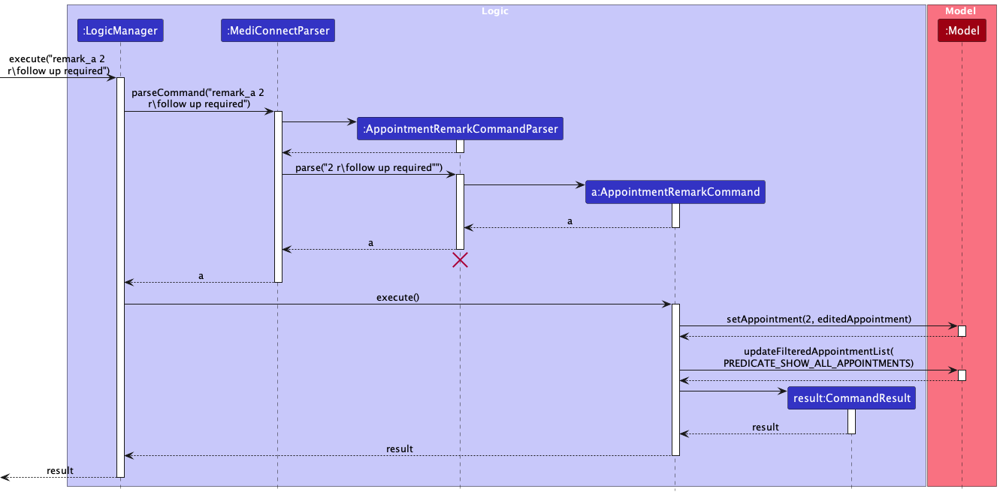
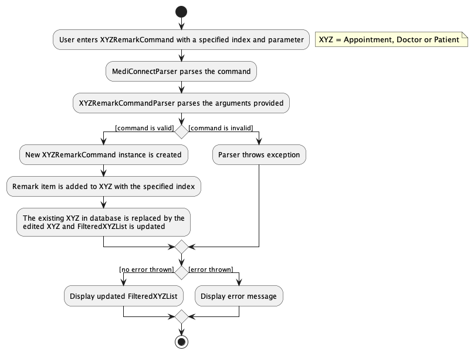
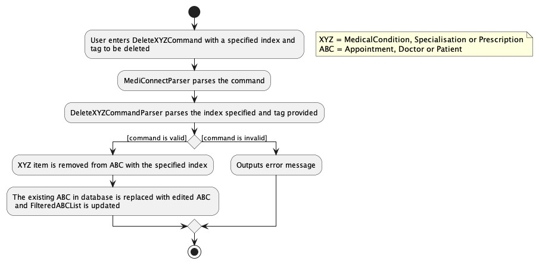
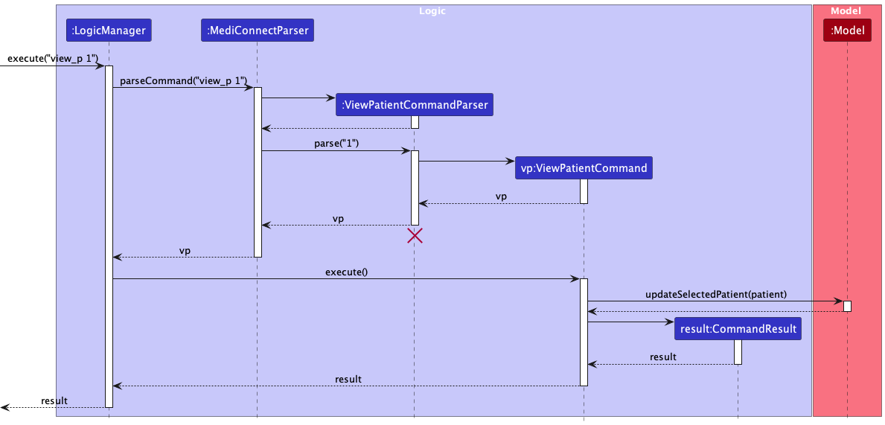
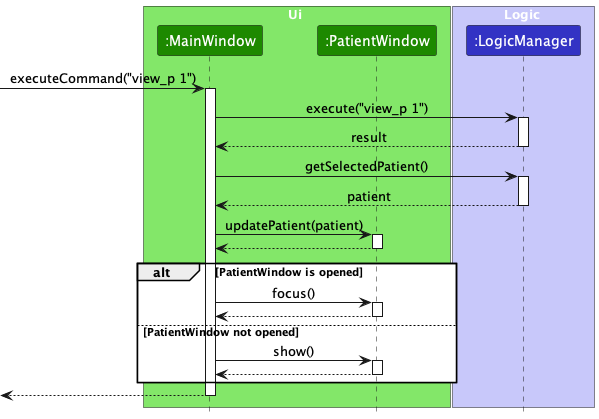

* Table of Contents
{:toc}

--------------------------------------------------------------------------------------------------------------------

## **Acknowledgements**

* Libraries used: [JavaFX](https://openjfx.io/), [Jackson](https://github.com/FasterXML/jackson), [JUnit5](https://github.com/junit-team/junit5).
* This project is based on [AddressBook Level 3 (AB3)](https://github.com/se-edu/addressbook-level3) by [SE-EDU initiative](https://se-education.org/)

--------------------------------------------------------------------------------------------------------------------

## **Setting up, getting started**

Refer to the guide [_Setting up and getting started_](SettingUp.md).

--------------------------------------------------------------------------------------------------------------------

## **Design**

:bulb: **Tip:** The `.puml` files used to create diagrams in this document `docs/diagrams` folder. Refer to the [_PlantUML Tutorial_ at se-edu/guides](https://se-education.org/guides/tutorials/plantUml.html) to learn how to create and edit diagrams.

### Architecture

The ***Architecture Diagram*** given above explains the high-level design of the App.

Given below is a quick overview of main components and how they interact with each other.

**Main components of the architecture**

**`Main`** (consisting of classes [`Main`](https://github.com/AY2324S1-CS2103T-T08-1/tp/blob/master/src/main/java/seedu/address/Main.java) and [`MainApp`](https://github.com/AY2324S1-CS2103T-T08-1/tp/blob/master/src/main/java/seedu/address/MainApp.java)) is in charge of the app launch and shut down.
* At app launch, it initializes the other components in the correct sequence, and connects them up with each other.
* At shut down, it shuts down the other components and invokes cleanup methods where necessary.

The bulk of the app's work is done by the following four components:

* [**`UI`**](#ui-component): The UI of the App.
* [**`Logic`**](#logic-component): The command executor.
* [**`Model`**](#model-component): Holds the data of the App in memory.
* [**`Storage`**](#storage-component): Reads data from, and writes data to, the hard disk.

[**`Commons`**](#common-classes) represents a collection of classes used by multiple other components.

**How the architecture components interact with each other**

The *Sequence Diagram* below shows how the components interact with each other for the scenario where the user issues the command `delete_p 1`.

Each of the four main components (also shown in the diagram above),

* defines its *API* in an `interface` with the same name as the Component.
* implements its functionality using a concrete `{Component Name}Manager` class (which follows the corresponding API `interface` mentioned in the previous point.

For example, the `Logic` component defines its API in the `Logic.java` interface and implements its functionality using the `LogicManager.java` class which follows the `Logic` interface. Other components interact with a given component through its interface rather than the concrete class (reason: to prevent outside component's being coupled to the implementation of a component), as illustrated in the (partial) class diagram below.

The sections below give more details of each component.

### UI component

The **API** of this component is specified in [`Ui.java`](https://github.com/AY2324S1-CS2103T-T08-1/tp/blob/master/src/main/java/seedu/address/ui/Ui.java)

The UI consists of a `MainWindow` that is made up of parts e.g.`CommandBox`, `ResultDisplay`, `PatientListPanel`, `StatusBarFooter` etc. All these, including the `MainWindow`, inherit from the abstract `UiPart` class which captures the commonalities between classes that represent parts of the visible GUI.

The `UI` component uses the JavaFx UI framework. The layout of these UI parts are defined in matching `.fxml` files that are in the `src/main/resources/view` folder. For example, the layout of the [`MainWindow`](https://github.com/AY2324S1-CS2103T-T08-1/tp/blob/master/src/main/java/seedu/address/ui/MainWindow.java) is specified in [`MainWindow.fxml`](https://github.com/AY2324S1-CS2103T-T08-1/tp/blob/master/src/main/resources/view/MainWindow.fxml)

The `UI` component,

* executes user commands using the `Logic` component.
* listens for changes to `Model` data so that the UI can be updated with the modified data.
* keeps a reference to the `Logic` component, because the `UI` relies on the `Logic` to execute commands.
* depends on some classes in the `Model` component, as it displays `Appointment`, `Doctor` and `Patient` object residing in the `Model`.

### Logic component

**API** : [`Logic.java`](https://github.com/AY2324S1-CS2103T-T08-1/tp/blob/master/src/main/java/seedu/address/logic/Logic.java)

Here's a (partial) class diagram of the `Logic` component:

The sequence diagram below illustrates the interactions within the `Logic` component, taking `execute("delete 1")` API call as an example.

:information_source: **Note:** The lifeline for `DeleteAppointmentCommandParser` should end at the destroy marker (X) but due to a limitation of PlantUML, the lifeline reaches the end of diagram.

How the `Logic` component works:

1. When `Logic` is called upon to execute a command, it is passed to an `MediConnectParser` object which in turn creates a parser that matches the command (e.g., `DeleteAppointmentCommandParser`) and uses it to parse the command.
1. This results in a `Command` object (more precisely, an object of one of its subclasses e.g., `DeleteAppointmentCommand`) which is executed by the `LogicManager`.
1. The command can communicate with the `Model` when it is executed (e.g. to delete a person).
1. The result of the command execution is encapsulated as a `CommandResult` object which is returned back from `Logic`.

Here are the other classes in `Logic` (omitted from the class diagram above) that are used for parsing a user command:

How the parsing works:
* When called upon to parse a user command, the `MediConnectParser` class creates an `XYZCommandParser` (`XYZ` is a placeholder for the specific command name e.g., `AddPatientCommandParser`) which uses the other classes shown above to parse the user command and create a `XYZCommand` object (e.g., `AddPatientCommand`) which the `MediConnectParser` returns back as a `Command` object.
* All `XYZCommandParser` classes (e.g., `AddPatientCommandParser`, `DeletePatientCommandParser`, ...) inherit from the `Parser` interface so that they can be treated similarly where possible e.g, during testing.

### Model component
**API** : [`Model.java`](https://github.com/AY2324S1-CS2103T-T08-1/tp/blob/master/src/main/java/seedu/address/model/Model.java)

A detailed breakdown of the subclasses of `Data` is shown below:

The `Model` component,

* stores the MediConnect data i.e., all `Appointment`, `Doctor` and `Patient` objects (which are contained in a `UniqueItemList<Appointment/Doctor/Appointment>` object respectively).
* stores the currently 'selected' `Data` objects (e.g., results of a search query) as a separate _filtered_ list which is exposed to outsiders as an unmodifiable `ObservableList<Data>` that can be 'observed' e.g. the UI can be bound to this list so that the UI automatically updates when the data in the list change.
* stores a `UserPref` object that represents the user’s preferences. This is exposed to the outside as a `ReadOnlyUserPref` objects.
* does not depend on any of the other three components (as the `Model` represents data entities of the domain, they should make sense on their own without depending on other components)

:information_source: **Note:** An alternative (arguably, a more OOP) model is given below. It has a `Tag` list in the `Database`, which `Data` references. This allows `Database` to only require one `Tag` object per unique tag, instead of each `Data` needing their own `Tag` objects. 

### Storage component

**API** : [`Storage.java`](https://github.com/AY2324S1-CS2103T-T08-1/tp/blob/master/src/main/java/seedu/address/storage/Storage.java)

The `Storage` component,
* can save both MediConnect data and user preference data in JSON format, and read them back into corresponding objects.
* inherits from both `DatabaseStorage` and `UserPrefStorage`, which means it can be treated as either one (if only the functionality of only one is needed).
* depends on some classes in the `Model` component (because the `Storage` component's job is to save/retrieve objects that belong to the `Model`)

### Common classes

Classes used by multiple components are in the `seedu.addressbook.commons` package.

--------------------------------------------------------------------------------------------------------------------

## **Implementation**

This section describes some noteworthy details on how certain features are implemented.

### Edit Appointment / Doctor / Patient feature

**Introduction**

This section describes the feature that allows users to edit appointments/doctors/patients in the MediConnect database by index.

#### Implementation

The proposed edit appointment/doctors/patient mechanism is facilitated by `LogicManager` and it extends `Logic`. It holds a `MediConnectParser` that parses the user input, and a `Model` where the command is executed. Additionally, it implements the following operations:

* `LogicManager#execute()` —  Executes the given user String input and returns a 'CommandResult'

Given below is an example usage scenario and how the edit patient mechanism behaves at each step.

Step 1: The user launches the application. The `Database` will be initialized with all data in the order that it was stored in.

Step 2: The user inputs `edit_p 5 p\23456789` command to edit the phone number of the 5th patient in the MediConnect database. The `edit_p` command calls `EditCommandParser#parse()` which parses the parameters to edit the current patient with. 
A new `EditPatientDescriptor` instance will be created in the parse command call, and a new `EditPatientCommand` instance will be created with the `EditPatientDescriptor` and the given `Index`.

Step 3: The created `EditPatientCommand` instance is returned to `LogicManager` and its `execute` method is called.
`EditPatientCommand#execute` then calls `Model#setPatient` and with the patient of the given `Index` and the target patient created by the `EditPatientDescriptor`.

The example usage scenario for the edit doctor and edit appointment mechanisms would be similar to the scenario above.

:information_source: **Note:** If a command fails its execution, it will not call `Model#setPatient()`, so the database will not be updated.

**UML Diagrams**

The following sequence diagram shows how the edit patient operation would work:

The sequence diagram for editing an appointment and editing a doctor would be similar.

The following activity diagram summarizes what happens when a user wants to edit an appointment/patient/doctor:

### Find Doctor / Patient

**Introduction**

This section describes the feature that allows users to find doctors/patient in the MediConnect database by name.

#### Implementation
The finding of a doctor/patient in MediConnect is facilitated by `LogicManager`, which extends `Logic`. It holds a `MediConnectParser` that parses the user input, and a Model where the command is executed. Additionally, it implements the following operations:

* `LogicManager#execute()` — Executes the given user String input and returns a CommandResult

These operations are exposed in the Ui interface as `Ui#executeCommand()`.

Given below is an example usage scenario and how the ListDoctorCommand/ListPatientCommand mechanism behaves at each step.

Step 1: The user inputs `find_d/find_p John` to search for doctors/patients named "John" in MediConnect.
* The `find_d/find_p` command triggers `MediConnectParser#parseCommand`, which identifies the command word and calls `FindDoctorCommandParser/FindPatientCommandParser#parse` to handle the arguments.

Step 2: The `FindDoctorCommandParser/FindPatientCommandParser#parse` method splits the argument "John" into a list of keywords. It then creates a `NameContainsKeywordsDoctorPredicate/NameContainsKeywordsPatientPredicate` object, using the list of keywords.

Step 3: A new `FindDoctorCommand/FindPatientCommand` instance is created using the `NameContainsKeywordsDoctorPredicate/NameContainsKeywordsPatientPredicate` object.

Step 4: The created `FindDoctorCommand/FindPatientCommand` instance is returned to `LogicManager`, and its `execute` method is called.
`FindDoctorCommand/FindPatientCommand#execute` filters the list of doctors/patients in `Model` using the `NameContainsKeywordsDoctorPredicate/NameContainsKeywordsPatientPredicate`.

Step 5: The filtered list is displayed to the user through the UI.

**UML Diagrams**

The following sequence diagram shows how the find doctor operation would work:

The sequence diagram for the find patient operation would be similar

The following activity diagram summarizes what happens when a user wants to find a new doctor/patient:

### List Doctors / Patients

**Introduction**

This section describes the feature that allows users to list doctors/patients in the MediConnect database.

#### Implementation

The listing of all doctors/patient in the database is facilitated by `LogicManager`. It extends `Logic` and stores the `MediConnectParser` that parses the user input, and the model in which the command is executed. Additionally, it implements the following operations:

* `LogicManager#execute` — Executes the given user String input and returns a `CommandResult`.

These operations are exposed in the Ui interface as `Ui#executeCommand()`.

Given below is an example usage scenario and how the `ListDoctorCommand` mechanism behaves at each step.

Step 1: The user inputs `list_d`. The application will display the `FilteredDoctorList`.

* The `list_d` command calls `MediConnectParser#parseCommand` which recognizes the command word as `list_d`.

* A new `ListDoctorCommand` instance will be created.

Step 2: The created `ListDoctorCommand` instance is returned to `LogicManager` and its execute method is called.

* `ListDoctorCommand#execute` then calls `Model#updateFilteredDoctorList` with the predicate `PREDICATE_SHOW_ALL_DOCTORS`.

* The `FilteredDoctorList` is updated to show all doctors by calling `ObservableList#setPredicate`.

Step 3: A `CommandResult` object is created with a message indicating success, and this result is returned to the UI to be displayed to the user.

The example usage scenario for the list patients mechanisms would be similar to the scenario above.

**UML Diagrams**

The following sequence diagram shows how the list doctor operation would work:

The sequence diagram for the list patient operation would be similar

The following activity diagram summarizes what happens when a user wants to list a new patient/doctor:

### List Appointments

**Introduction**

This section describes the feature that allows users to list appointments in the MediConnect database. Users can either list all appointments or filter them based on the NRIC of doctors or patients.

#### Implementation

The listing of appointments in MediConnect is facilitated by the `LogicManager`, which implements the `Logic` interface. It holds a `MediConnectParser` that parses the user input, and a model where the command is executed. Additionally, it implements the following operations:

* `LogicManager#execute()` — Executes the given user String input and returns a `CommandResult`.

These operations are exposed in the Ui interface as `Ui#executeCommand()`.

Given below is an example usage scenario and how the `ListAppointmentCommand` mechanism behaves at each step:

Step 1: The user inputs `list_a` to list all appointments or `list_a pic\PATIENT_NRIC dic\DOCTOR_NRIC` to filter appointments.
* The `list_a` command triggers `MediConnectParser#parseCommand`, which identifies the command word and calls `ListAppointmentCommandParser#parse` to handle the arguments.

Step 2: The `ListAppointmentCommandParser#parse` method checks for the presence of optional flags like `dic\` for doctor NRIC and `pic\` for patient NRIC. Based on these, it creates appropriate `Predicate` objects.

Step 3: A new `ListAppointmentCommand` instance is created using the `Predicate` object(s).

Step 4: The created `ListAppointmentCommand` instance is returned to `LogicManager`, and its execute method is called.
* `ListAppointmentCommand#execute` filters the list of appointments in `Model` using the specified predicate(s).

Step 5: The filtered list is displayed to the user through the UI.

**UML Diagrams**

The following sequence diagram shows how the list appointment operation would work:

The following activity diagram summarizes what happens when a user wants to list a new appointment:

### Add Appointment / Doctor / Patient feature

**Introduction**

This section describes the add appointment/doctor/patient features.

#### Implementation
The adding of an appointment/doctor/patient to MediConnect is facilitated by `LogicManager`. It extends `Logic` and stores the `MediConnectParser` that parses the user input, and the model in which the command is executed. Additionally, it implements the following operations:

* `LogicManager#execute()` —  Executes the given user String input and returns a `CommandResult`

These operations are exposed in the `Ui` interface as `Ui#executeCommand()`.

Given below is an example usage scenario and how the add `Appointment` mechanism behaves at each step.

Step 1. The user launches the application. The `Database` will be initialized with all data in the order that it was stored in.

Step 2. The user inputs `add_a pic\T0123456J dic\S9876543F from\2023-12-01 07:30 to\2023-12-01 08:30` to add an appointment into MediConnect.
The `add_a` command calls `AddAppointmentCommandParser#parse` which parses the parameters that build the appointment to be added.
A new `AddAppointmentCommand` instance will be created with the correct `Appointment` object to be added.

Step 3. The created `AddAppointmentCommand` instance is returned to `LogicManager` and its `execute` method is called.
`AddAppointmentCommand#execute` then calls `Model#addAppointment` and with the given `Appointment`.

The example usage scenario for the add patient and add doctor mechanisms would be similar to the scenario above.

**UML Diagrams**

The following sequence diagram shows how the add appointment operation would work:

The sequence diagram for the add patient and add doctor operations would be similar.

The following activity diagram summarizes what happens when a user wants to add a new appointment/patient/doctor:

### Delete Appointment / Doctor / Patient feature

**Introduction**
This section describes the delete appointment/doctor/patient features.

#### Implementation
The deletion of an appointment/doctor/patient from MediConnect is facilitated by `LogicManager`. It extends `Logic` and stores the `MediConnectParser` that parses the user input, and the model in which the command is executed. Additionally it implements the following operations:

* `LogicManager#execute()` —  Executes the given user String input and returns a `CommandResult`

These operations are exposed in the `Ui` interface as `Ui#executeCommand()`.

Given below is an example usage scenario and how the add `Appointment` mechanism behaves at each step.

Step 1. The user launches the application. The `Database` will be initialized with all data in the order that it was stored in.

Step 2. The user inputs `delete_a 2`  to delete an appointment into MediConnect.
The `delete_a` command calls `DeleteAppointmentCommandParser#parse` which parses the index argument which is the index of the appointment to delete
A new `DeleteAppointmentCommand` instance will be created

Step 4. The created `DeleteAppointmentCommand` instance is returned to `LogicManager` and its `execute` method is called.
`DeleteAppointmentCommand#execute` then calls `Model#deleteAppointment` and with the given `Index`.

The example usage scenario for the delete patient and delete doctor mechanisms would be similar to the scenario above.

**UML Diagrams**

The following sequence diagram shows how the delete appointment operation would work:

The sequence diagram for the delete patient and doctor operations would be similar.

The following activity diagram summarizes what happens when a user wants to delete an appointment/patient/doctor:

### Edit remark feature

**Introduction**
This section describes the appointment/doctor/patient remark features.

#### Implementation
The adding/deleting/editing of a remark for an appointment/doctor/patient in MediConnect is facilitated by `LogicManager`. It extends `Logic` and stores the `MediConnectParser` that parses the user input, and the model in which the command is executed. Additionally, it implements the following operations:

* `LogicManager#execute()` —  Executes the given user String input and returns a `CommandResult`

These operations are exposed in the `Ui` interface as `Ui#executeCommand()`.

Given below is an example usage scenario and how the edit `Remark` of an `Appointment` mechanism behaves at each step.

Step 1: The user launches the application. The `Database` will be initialized with all data in the order that it was stored in.

Step 2: The user inputs `remark_a 2 r\follow up required` to edit the remark of the second appointment in the appointment list.
The `remark_a` command calls `AppointmentRemarkCommandParser#parse` which parses the parameters that is used to edit the remark of the appointment specified.
A new `AppointmentRemarkCommand` instance will be created with the correct `Remark` object to be added to the appointment specified.

Step 3: The created `AppointmentRemarkCommand` instance is returned to `LogicManager` and its `execute` method is called.
`AppointmentRemarkCommand#execute` then calls `Model#setAppointment` and with the given `Remark`.
The edited `Appointment` is then added to the filteredAppointmentList by calling `FilteredList#setAppointment`.

The example usage scenario for the edit patient remark and edit doctor remark mechanisms would be similar to the scenario above.

The following sequence diagram shows how the edit appointment remark operation would work:

The sequence diagram for the editing patient and doctor remark would be similar.

The following activity diagram summarizes what happens when a user wants to edit the remark of an appointment/patient/doctor:

### Add Specialisation / Medical condition / Prescription feature

**Introduction**

This section describes the add specialisations/medical conditions/prescriptions features.

#### Implementation
The addition of a specialisation/medical condition/prescription to an existing doctor/patient/appointment respectively in MediConnect is facilitated by `LogicManager`. It extends `Logic` and stores the `MediConnectParser` that parses the user input, and the model in which the command is executed. Additionally, it implements the following operations:

* `LogicManager#execute()` —  Executes the given user String input and returns a `CommandResult`

These operations are exposed in the `Ui` interface as `Ui#executeCommand()`.

Given below is an example usage scenario and how the add specialisation mechanism behaves at each step.

Step 1. The user launches the application. The `Database` will be initialized with all data in the order that it was stored in.

Step 2. The user inputs `list_d`. MediConnect will display the `FilteredDoctorList`.

Step 3. The user inputs `add_tag_d 2 t\Orthopaedic`  to add the prescription `Orthopaedic` to the doctor at index 2 in the displayed doctor list.
The `add_tag_d` command calls `AddSpecialisationCommandParser#parse` the index argument which is the index of the doctor we are adding the tag into. It also parses the tag argument which contains the specialisation to be added.

Step 4. The created `AddSpecialisationCommand` instance is returned to `LogicManager` and its `execute` method is called.
`AddSpecialisationCommand#execute` then calls `Model#setDoctor` and with the given `Index` and the doctor with the updated specialisation.

The example usage scenario for the add prescription and add medical condition mechanisms would be similar to the scenario above.

The following sequence diagram shows how the add specialisation operation would work:

The sequence diagram for the add prescription and medical condition operations would be similar.

The following activity diagram summarizes what happens when a user wants to add a specialisation/medical condition/prescription:

### Delete Specialisation / Medical Condition / Prescription feature
This section describes the delete specialisation/medical condition/prescription features.

#### Implementation
The deletion of a specialisation/medical condition/prescription to MediConnect is facilitated by `LogicManager`. It extends `Logic` and stores the `MediConnectParser` that parses the user input, and the model in which the command is executed. Additionally it implements the following operations:

* `LogicManager#execute()` —  Executes the given user String input and returns a `CommandResult`

These operations are exposed in the `Ui` interface as `Ui#executeCommand()`.

Given below is an example usage scenario and how the add `Specialisation` mechanism behaves at each step.

Step 1. The user launches the application. The `Database` will be initialized with all data in the order that it was stored in.

Step 2. The user inputs `delete_tag_d 2 t\Orthopaedic`  to delete a doctor's specialisation from MediConnect.
The `delete_tag_d` command calls `DeleteSpecialisationCommandParser#parse` which parses the index argument which is the index of the doctor to delete  
A new `DeleteSpecialisationCommand` instance will be created

Step 3. The created `DeleteSpecialisationCommand` instance is returned to `LogicManager` and its `execute` method is called.
`DeleteSpecialisationCommand#execute` then calls `Model#getFilteredDoctorList` and retrieve the doctor with the given `Index`. 
Then, the specialisation will be removed from the doctor if exists and replace the existing doctor in Model with the command of `Model#setDoctor`.

The example usage scenario for delete medical condition and delete prescriptions mechanisms would be similar to the scenario above.

The following sequence diagram shows how the delete specialisation operation would work and will be similar to deletion of medical condition and prescription:

The following activity diagram summarizes what happens when a user wants to delete a specialisation/medical condition/prescription:

### View Appointment / Doctor / Patient feature

This section describes the feature that allows users to view the full details of appointments/doctors/patients in the MediConnect database by index.

#### Implementation

The View Patient mechanism is facilitated by `ModelManager`. It extends `Model` and stores the appointment, doctor
and patient to be shown as `selectedAppointment`, `selectedDoctor` and `selectedPatient` respectively. Additionally, it implements the following operations:

- `ModelManager#getSelectedAppointment()`  —  Returns the Appointment currently selected in the Model.
- `ModelManager#updateSelectedAppointment()`  —  Sets the selected Appointment currently in the Model.
- `ModelManager#getSelectedDoctor()`  —  Returns the Doctor currently selected in the Model.
- `ModelManager#updateSelectedDoctor()`  —  Sets the selected Doctor currently in the Model.
- `ModelManager#getSelectedPatient()`  —  Returns the Patient currently selected in the Model.
- `ModelManager#updateSelectedPatient()`  —  Sets the selected Patient currently in the Model.

The getter operations are exposed in the `Logic` interface as `Logic#getSelectedAppointment()`, `Logic#getSelectedDoctor()` and `Logic#getSelectedPatient()`.

It is also facilitated by `AppointmentWindow`, `DoctorWindow` and `PatientWindow` which extend `UiPart`. They are stored in the `MainWindow` and implements the following operations:

- `AppointmentWindow#updateAppointment()`  —  Sets the Appointment to be shown in the window.
- `AppointmentWindow#show()`  —  Displays the Appointment Window.
- `AppointmentWindow#focus()`  —  Toggles to the Appointment Window.
- `DoctorWindow#updatePatient()`  —  Sets the Doctor to be shown in the window.
- `DoctorWindow#show()`  —  Displays the Doctor Window.
- `DoctorWindow#focus()`  —  Toggles to the Doctor Window.
- `PatientWindow#updatePatient()`  —  Sets the Patient to be shown in the window.
- `PatientWindow#show()`  —  Displays the Patient Window.
- `PatientWindow#focus()`  —  Toggles to the Patient Window.

Lastly, it is also facilitated by `CommandResult` which stores the boolean value `showAppointment`, `showDoctor` and `showPatient` and implement the following operations:

- `CommandResult#isShowAppointment()`  —  Indicates if the command is View Appointment
- `CommandResult#isShowDoctor()`  —  Indicates if the command is View Doctor
- `CommandResult#isShowPatient()`  —  Indicates if the command is View Patient

Given below is an example usage scenario and how the View Patient mechanism behaves at each step.

Step 1: The user launches the application for the first time. `selectedAppointment`, `selectedDoctor` and `selectedPatient` has not been initialised and `AppointmentWindow`, `DoctorWindow` and `PatientWindow` are closed by default.

Step 2: The user executes `view_p 2` command to view the 2nd patient in the patient list. The `view` command calls `ModelManager#getSelectedPatient()`, causing the `selectedPatient` to be initialised the 2nd patient in the patient list.
The `CommandResult` returned will call `PatientWindow#updatePatient()` followed by `PatientWindow#show()`, launching the `PatientWindow` with the details of the 2nd patient.

Step 3: The user toggle back to the main window and executes `view_p 4` command to view the 4th patient in the patient list. The `view` command calls `ModelManager#getSelectedPatient()`, causing the `selectedPatient` to be updated with the 4th patient in the patient list.
The `CommandResult` returned will call `PatientWindow#updatePatient()` followed by `PatientWindow#focus()`, toggling to the `PatientWindow` with the details of the 4th patient.

    :information_source: **Note:** If the user decides to close the Patient Window before executing the command, `PatientWindow#focus()` will not be invoked, instead it will invoke `PatientWindow#show()` similar to Step 2.

The View Doctor and View Appointment mechanism function similarly by utilising on their respective filtered lists, methods and windows.

**UML Diagrams**

The following sequence diagram shows how the View Patient command is executed in the `Logic`:

The sequence diagram for View Appointment and View Doctor would be similar.

The following sequence diagram shows how the View Patient command results is handled in the `Ui`:

The sequence diagram for View Appointment and View Doctor would be similar.

The following activity diagram summarizes what happens when a user executes a new view command:

#### Design considerations:

**Aspect: How view appointment / doctor / patient executes:**

* **Alternative 1 (current choice):** Store the selected Patient in the model and retrieve on `CommandResult` instruction.
    * Pros: Straight forward to implement.
    * Cons: Requires extensive additions to the `Model` and `Logic` interface.

* **Alternative 2:** Store selected Patient in `CommandResult` and retrieve directly from there.
    * Pros: No changes to the `Model` and `Logic` interface required.
    * Cons: Reduces `CommandResult` cohesiveness as it will now have the responsibility of passing the selected Patient to the Ui.

--------------------------------------------------------------------------------------------------------------------

## **Documentation, logging, testing, configuration, dev-ops**

* [Documentation guide](Documentation.md)
* [Testing guide](Testing.md)
* [Logging guide](Logging.md)
* [Configuration guide](Configuration.md)
* [DevOps guide](DevOps.md)

--------------------------------------------------------------------------------------------------------------------

## **Appendix: Requirements**

### Product scope

**Target user profile**:

* has a need to manage a significant number of patients and doctors
* has a need to manage appointments between the patients and doctors
* prefers desktop apps over other types
* can type fast
* prefers typing to mouse interactions
* is reasonably comfortable using CLI apps

**Value proposition**:
* provides easy storage and management of patients' and doctors' profiles
* provides convenient management of appointments of doctors and patients

### User stories

Priorities: High (Must-Have) - * * *, Medium (Good-To-Have) - * *, Low (To-Forgo) - *

| Priority  | As a …  | I want to …                                            | So that I can…                                                                      |
|-----------|---------|--------------------------------------------------------|-------------------------------------------------------------------------------------|
| * * *     | user    | add appointment into the system                        | keep track of a new appointment                                                     |
| * * *     | user    | add doctor's profile into the system                   | keep track of a new doctor working in the clinic                                    |
| * * *     | user    | add patient's data into the system                     | keep track of a new patient visiting the clinic                                     |
| * * *     | user    | delete an appointment from the system                  | remove any appointment that has been cancelled from the system                      |
| * * *     | user    | delete doctor profile from the system                  | remove any doctor no longer working for the clinic                                  |
| * * *     | user    | delete patients' data from the system                  | remove any patient no longer visiting the clinic                                    |
| * * *     | user    | view the list of appointment in the system             | see all the appointments currently in the system                                    |
| * * *     | user    | view the list of doctor in the system                  | see all the doctors currently in the system                                         |
| * * *     | user    | view the list of patient in the system                 | see all the patients currently in the system                                        |
| * * *     | user    | edit an appointment in the system                      | correct any mistake made when adding or updating the appointment previously         |
| * * *     | user    | edit a doctor's details in the system                  | correct any mistake made when adding or updating the doctor previously              |
| * * *     | user    | edit a patient’s data in the system                    | correct any mistake made when adding or updating the patient previously             |
| * *       | user    | view the full details of an appointment                | retrieve the medicine prescribed or information discovered during that appointment. |
| * *       | user    | view the full details of an doctor                     | retrieve the doctor's availability and specialisation.                              |
| * *       | user    | view the full details of an patient                    | retrieve the specified patient's full medical history and any ongoing treatment     |
| * *       | user    | add remarks for an appointment                         | note down any significant finding during the appointment                            |
| * *       | user    | add remarks for a doctor                               | note down the availability of the specified doctor                                  |
| * *       | user    | add remarks for a patient                              | note down any ongoing treatment of the specified patient                            |
| * *       | user    | add prescription for an appointment                    | keep track of the medicine prescribed during the specified appointment.             |
| * *       | user    | remove prescription for an appointment                 | update the medicine prescribed during the specified appointment.                    |
| * *       | user    | add specialisation for a doctor                        | keep track of the specified  doctor's specialisation.                               |
| * *       | user    | remove specialisation for a doctor                     | update the specified doctor's specialisation.                                       |
| * *       | user    | add medical condition for a patient                    | keep track of the medical condition the specified patient has.                      |
| * *       | user    | remove medical condition for a patient                 | update the specified patient's medical condition.                                   |
| *         | user    | view the list of appointment sorted by start date time | look through the list of appointment in a chronological manner.                     |
| *         | user    | view the list of doctor sorted by name                 | look through the list of doctors logically.                                         |
| *         | user    | view the list of patient sorted by name                | look through the list of patient in a logical manner.                               |

### Use cases

(For all use cases below, the **System** is the `MediConnect` and the **Actor** is the `user`, unless specified otherwise)

**Use case: UC01 List all patients**

**MSS**

1.  User requests to list all the patients.
2.  MediConnect lists all the patients.
3.  MediConnect shows a success message to the user.

    Use case ends.

**Extensions**

* 1a. MediConnect detects that the command is invalid.
    * 1a1. MediConnect shows an error message.
    * 1a2. MediConnect requests for the correct input.
      
      Use case resumes at step 1.

**Use case: UC02 View a patient's full record**

**MSS**

1.  User requests to view a patient's record.
2.  MediConnect shows the patient’s record.
3.  MediConnect shows a success message to the user.

    Use case ends.

**Extensions**

* 1a. MediConnect detects that the command is invalid.
    * 1a1. MediConnect shows an error message.
    * 1a2. MediConnect requests for the correct input.

      Use case resumes at step 1.
* 1b. The patient does not exist in the system.
    * 1b1. MediConnect shows an error message.
    
      Use case ends.

**Use case: UC03 Add a patient**

**MSS**

1.  User requests to add a specific patient to the system.
2.  MediConnect adds the specific patient to the system.
3.  MediConnect shows a success message to the user.

    Use case ends.

**Extensions**

* 1a.MediConnect detects that the arguments provided to add a patient is invalid.
    * 1a1. MediConnect shows an error message.    
    * 1a2. MediConnect requests for the correct input.

      Use case resumes at step 1.

* 1b. MediConnect detects that patient to be added already exists in the system.
    * 1b1. MediConnect shows an error message.

      Use case ends.

**Use case: UC04 Edit a patient’s particulars**

**MSS**

1.  User edits a specific patient’s particulars.
2.  MediConnect edits the patient’s particulars.
3.  MediConnect shows a success message to the user.

    Use case ends.

**Extensions**

* 1a.MediConnect detects that the arguments provided to edit a patient is invalid.
    * 1a1. MediConnect shows an error message.
    * 1a2. MediConnect requests for the correct input.
   
      Use case resumes at step 1.
  
**Use case: UC05 Delete a patient**
  
**MSS**

1.  User requests to delete a specific patient in the system.
2.  MediConnect deletes the patient.
3.  MediConnect shows a success message to the user.

    Use case ends.

**Extensions**

* 1a. MediConnect detects that the patient list is empty.

  Use case ends.
* 1b. MediConnect detects that the given index is invalid.
    * 1b1. MediConnect shows an error message.
    * 1b2. MediConnect requests for the correct input.

      Use case resumes at step 1.

**Use case: UC06 Edit a specified patient’s remark**

**MSS**

1.  User requests to edit a patient’s remarks.
2.  MediConnect edits the patient’s remarks.
3.  MediConnect shows a success message to the User.

Use case ends.

**Extensions**

* 1a. MediConnect detects that the given command is invalid.
    * 1a1. MediConnect shows an error message.
    * 1a2. MediConnect requests the correct input.

      Use case resumes at step 1.
* 1b. MediConnect detects that the given patient does not exist in the system.
    * 1b1. MediConnect shows an error message.
  
      Use case ends.

**Use case: UC07 Add a medical condition to a patient**

**MSS**

1.  User requests to add a medical condition to a patient.
2.  MediConnect adds a medical condition to a patient.
3.  MediConnect shows a success message to the user.

Use case ends.

Extensions

* 1a. MediConnect detects that the given command is invalid.
    * 1a1. MediConnect shows an error message.
    * 1a2. MediConnect requests the correct input. 
  
      Use case resumes at step 1.
* 1b. MediConnect detects that the given patient does not exist in the system.
    * 1b1. MediConnect shows an error message.
  
      Use case ends.
* 1c. MediConnect detects that the patient already has the given medical condition.
    * 1c1. MediConnect shows an error message.
  
      Use case ends.

**Use case: UC08 Delete medical condition from a patient**

**MSS**

1.  User requests to delete a medical condition from a patient.
2.  MediConnect deletes the medical condition from the patient.
3.  MediConnect shows a success message to the User.

Use case ends.

**Extensions**

* 1a. MediConnect detects that the given command is invalid.
    * 1a1. MediConnect shows an error message.
    * 1a2. MediConnect requests the correct input.
      
     Use case resumes at step 1.
* 1b. MediConnect detects that the given patient does not exist in the system.
    * 1b1. MediConnect shows an error message.
  
      Use case ends.
* 1c. MediConnect detects that the given patient does not have the specified medical condition.
    * 1c1. MediConnect shows an error message.
  
      Use case ends.

**Use case: UC09 List all doctors**

**MSS**

1.  User requests to list all doctors.
2.  MediConnect shows the list of all doctors.
3.  MediConnect shows a success message to the user.

    Use case ends.

**Extensions**

* 1a. MediConnect detects that the command is invalid.
    * 1a1. MediConnect shows an error message.
    * 1a2. MediConnect requests for the correct input. 
    
       Use case resumes at step 1.

**Use case: UC10 View a doctor’s full record**

**MSS**

1.  User requests to view a doctor's full record.
2.  MediConnect shows the doctor’s full record.
3.  MediConnect shows a success message to the user.

    Use case ends.

**Extensions**

* 1a. MediConnect detects that the command is invalid.
    * 1a1. MediConnect shows an error message. 
    * 1a2. MediConnect requests for the correct input.

      Use case resumes at step 1.
* 1b. MediConnect detects that the doctor does not exist in the system.
    * 1b1. MediConnect shows an error message. 
  
      Use case resumes at step 1.

**Use case: UC11 Add a doctor**

**MSS**

1. User requests to add a specific doctor to the system.
2. MediConnect adds the specific doctor to the system. 
3. MediConnect shows a success message to the user.

    Use case ends.
  
**Extensions**
  
* 1a. MediConnect detects that the arguments provided to add a doctor is invalid.
    * 1a1. MediConnect shows an error message.
    * 1a2. MediConnect requests for the correct input.
  
      Use case resumes at step 1.
* 1b. MediConnect detects that doctor to be added already exists in the system.
   * 1b1. MediConnect shows an error message.
  
     Use case ends.

**Use case: UC12 Edit a doctor’s particulars**

**MSS**

1.  User requests to edit a specific doctor’s particulars.
2.  MediConnect edits the doctor’s particulars.
3.  MediConnect shows a success message to the user.

    Use case ends.

**Extensions**

* 1a.MediConnect detects that the arguments provided to edit a doctor is invalid.
    * 1a1. MediConnect shows an error message.
    * 1a2. MediConnect requests for the correct input.
  
      Use case resumes at step 1.
* 1b. MediConnect detects that doctor to be edited does not exist in the system.
    * 1b1. MediConnect shows an error message.
  
      Use case ends.

**Use case: UC13  Edit a specified doctor’s remark**

**MSS**

1.  User requests to edit a doctor’s remarks.
2.  MediConnect edits the doctor’s remarks.
3.  MediConnect shows a success message to the user.

    Use case ends.

**Extensions**

* 1a.MediConnect detects that the given command is invalid.
    * 1a1. MediConnect shows an error message.
    * 1a2. MediConnect requests the correct input.

      Use case resumes at step 1.
* 1b. MediConnect detects that the given doctor does not exist in the system.
  * 1b1. MediConnect shows an error message. 
  
      Use case ends.

**Use case: UC14 Add specialisation to a doctor**

**MSS**

1. User requests to add a specialisation to a doctor.
2. MediConnect adds a specialisation to a doctor.
3. MediConnect shows a success message to the user.

   Use case ends.

**Extensions**

* 1a. MediConnect detects that the given command is invalid.
    * 1a1. MediConnect shows an error message.
    * 1a2. MediConnect requests the correct input。

      Use case resumes at step 1.

* 1b. MediConnect detects that the given doctor does not exist in the system.
  * 1b1. MediConnect shows an error message.

    Use case ends.

* 1c. MediConnect detects that the doctor already has the  given specialisation.
  * 1c1. MediConnect shows an error message.

    Use case ends.

**Use case: UC15 Delete specialisation from a doctor**

**MSS**

1. User requests to delete a specialisation from a doctor.
2. MediConnect deletes the specialisation from the doctor.
3. MediConnect shows a success message to the User.

    Use case ends.

**Extensions**

* 1a. MediConnect detects that the given command is invalid.
  * 1a1. MediConnect shows an error message.
  * 1a2. MediConnect requests the correct input.

    Use case resumes at step 1.

* 1b. MediConnect detects that the given doctor does not exist in the system.
  * 1b1. MediConnect shows an error message.

    Use case ends.

* 1c. MediConnect detects that the given doctor does not have the specified specialisation.
  * 1c1. MediConnect shows an error message.
  
    Use case ends.

**Use case: UC16 Delete a doctor**

**MSS**

1. User requests to delete a specific doctor in the list.
2. MediConnect deletes the doctor.
3. MediConnect shows a success message to the User.

    Use case ends.

**Extensions**

* 1a. MediConnect detects that the given arguments to delete a doctor is invalid.
  * 1a1. MediConnect shows an error message. 
  * 1a2. MediConnect requests for the correct input.

    Use case resumes at step 1.

**Use case: UC17 View a patient’s appointments**

**MSS**

1. User requests to view a patient’s appointments.
2. MediConnect shows the patient’s appointment list.

    Use case ends.

**Extensions**

* 1a. MediConnect detects that the command is invalid. 
  * 1a1. MediConnect shows an error message. 
  * 1a2. MediConnect requests the correct input.

    Use case resumes at step 1.

* 1b. MediConnect detects that the patient does not exist in the system. 
  * 1b1. MediConnect shows an error message.

    Use case ends.

**Use case: UC18 View a doctor’s appointments**

**MSS**

1. User requests to view a doctor’s list of  appointments. 
2. MediConnect shows the doctor’s appointment list.

    Use case ends.

**Extensions**

* 1a. MediConnect detects that the command is invalid. 
  * 1a1. MediConnect shows an error message. 
  * 1a2. MediConnect requests the correct input.

    Use case resumes at step 1.

* 1b. MediConnect detects that the doctor does not exist in the system. 
  * 1b1. MediConnect shows an error message.

    Use case ends.

**Use case: UC19 Add a new appointment**

**MSS**

1. User requests to add a specific appointment between a patient and doctor. 
2. MediConnect adds the appointment to the appointment list.

    Use case ends.

**Extensions**

* 1a.MediConnect detects that the arguments provided to add an appointment is invalid. 
  * 1a1. MediConnect shows an error message. 
  * 1a2. MediConnect requests for the correct input.

    Use case resumes at step 1.

* 1b. MediConnect detects that the appointment to be added already exists in the system.
  * 1b1. MediConnect shows an error message.

    Use case ends.

**Use case: UC20 Edit an appointment’s particulars**

**MSS**

1. User requests to edit an appointment’s particulars. 
2. MediConnect edits the appointment particulars.

    Use case ends.

**Extensions**

* 1a.MediConnect detects that the arguments provided to edit an appointment are invalid. 
  * 1a1. MediConnect shows an error message. 
  * 1a2. MediConnect requests for the correct input.

    Use case resumes at step 1.

* 1b. MediConnect detects that the appointment to be edited does not exist in the system. 
  * 1b1. MediConnect shows an error message.

    Use case ends.

**Use case: UC21 Delete an appointment**

**MSS**

1. User requests to delete an appointment from the appointment list.
2. MediConnect deletes the appointment.

    Use case ends.

**Extensions**

* 1a. The list is empty.

    Use case ends.

* 1b. MediConnect detects that the given index is invalid. 
  * 1b1. MediConnect shows an error message. 
  * 1b2. MediConnect requests the correct input.

    Use case resumes at step 1.

**Use case: UC22 Edit a specified appointment remark**

**MSS**

1. User requests to edit an appointment’s remarks. 
2. MediConnect edits the appointment’s remarks. 
3. MediConnect shows a success message to the User.

    Use case ends.

**Extensions**

* 1a. MediConnect detects that the given command is invalid. 
  * 1a1. MediConnect shows an error message.
  * 1a2. MediConnect requests the correct input.

    Use case resumes at step 1.

* 1b. MediConnect detects that the given appointment does not exist in the system. 
  * 1b1. MediConnect shows an error message.

    Use case ends.

**Use case: UC23 Add prescription**

**MSS**

1. User requests to add a prescription to an appointment. 
2. MediConnect adds a prescription to an appointment. 
3. MediConnect shows a success message to the User.

    Use case ends.

**Extensions**

* 1a. MediConnect detects that the given command is invalid. 
  * 1a1. MediConnect shows an error message. 
  * 1a2. MediConnect requests the correct input.

    Use case resumes at step 1.

* 1b. MediConnect detects that the given appointment does not exist in the system. 
  * 1b1. MediConnect shows an error message.

    Use case ends.

* 1c. MediConnect detects that the given prescription already exists in the appointment. 
  * 1c1. MediConnect shows an error message.

    Use case ends.

**Use case: UC24 Delete prescription**
**MSS**

1. User requests to delete a prescription from an appointment. 
2. MediConnect deletes a prescription from an appointment. 
3. MediConnect shows a success message to the User.

    Use case ends.

**Extensions**

* 1a. MediConnect detects that the given command is invalid. 
  * 1a1. MediConnect shows an error message. 
  * 1a2. MediConnect requests the correct input.

    Use case resumes at step 1.

* 1b. MediConnect detects that the given appointment does not exist in the system. 
  * 1b1. MediConnect shows an error message.

    Use case ends.

* 1c. MediConnect detects that the given prescription does not exist in the appointment. 
  * 1c1. MediConnect shows an error message.

    Use case ends.

### Non-Functional Requirements

1. Should work on any _mainstream OS_ as long as it has Java `11` or above installed.
2. Should be able to handle at least 3,000 patients at any point of time.
3. Should be able to add, view, edit and delete patients and doctors without a noticeable lag.
4. Should be able to retrieve all appointments for a particular doctor or patient within 1 second.
6. A user with above average typing speed for regular English text (i.e. not code, not system admin commands) should be able to accomplish most of the tasks faster using commands than using the mouse.

### Glossary

* **Appointment**: A arranged meeting between a patient and a doctor at a particular date and time
* **Doctor**: A person providing medical services at UHC
* **Mainstream OS**: Windows, Linux, Unix, OS-X
* **NRIC**: Identity card number of the National Registration Identity Card, used as the primary means of identification for patients and doctors in MediConnect
* **Patient**: A person receiving medical services at UHC
* **Receptionist**: A person handling administrative work at UHC, and is the target user of MediConnect

--------------------------------------------------------------------------------------------------------------------

## **Appendix: Instructions for manual testing**

Given below are instructions to test the app manually.

:information_source: **Note:** These instructions only provide a starting point for testers to work on;
testers are expected to do more *exploratory* testing.

### Launch and shutdown

1. Initial launch

   1. Download the jar file and copy into an empty folder

   1. Double-click the jar file Expected: Shows the GUI with a set of sample contacts. The window size may not be optimum.

1. Saving window preferences

   1. Resize the window to an optimum size. Move the window to a different location. Close the window.

   1. Re-launch the app by double-clicking the jar file. 
       Expected: The most recent window size and location is retained.

### Deleting a patient

1. Deleting a patient while all patients are being shown

   1. Prerequisites: List all patients using the `list_p` command. Multiple patients in the list.

   1. Test case: `delete_p 1` 
      Expected: First patient is deleted from the list. Details of the deleted patient shown in the status message.

   1. Test case: `delete_p 0` 
      Expected: No patient is deleted. Error details shown in the status message.

   1. Other incorrect delete commands to try: `delete_p`, `delete_p x`, `...` (where x is larger than the list size) 
      Expected: Similar to previous.

### Saving data

1. Dealing with missing/corrupted data files

   1. Prerequisites: The database.json file in the data directory must exist.
   
   2. Test case: Delete the database.json file
      Expected: The app launches successfully, populated with the sample data.
   
   3. Test case: Delete the contents of the database.json file
      Expected: The app launches successfully, populated with no data.
   
   4. Test case: Add random characters to anywhere in the json file within the first set of curly brackets.
      Expected: Similar to previous.

1. Dealing with wrongly edited data files

   1. Prerequisites: The database.json file in the data directory must exist.
   
   2. Test case: Remove a field from any one of the doctors (e.g. nric, name, etc.)
      Expected: The app launches successfully, populated with no data.
   
   3. Test case: Remove a field from any one of the patients (e.g. nric, name, etc.)
      Expected: Similar to previous.
   
   4. Test case: Remove a field from any one of the appointments (e.g. patientNric, doctorNric, etc.)
      Expected: Similar to previous. 
   
   5. Test case: Edit the nric of a patient without editing the corresponding appointments.
      Expected: Similar to previous.

--------------------------------------------------------------------------------------------------------------------

## **Appendix: Planned Enhancement**

This section covers the list of planned enhancements to address any existing feature flaws.

### Specifying whether the patient or doctor NRIC is invalid when using `add_a` or `edit_a`

Currently, if a user enters an invalid NRIC for either of the parameters `DOCTOR_NRIC` and `PATIENT_NRIC`,
the result box will only state `NRIC should not be blank, should start with 'S', 'T', 'F', 'G' or 'M', contain 7 numbers, and end with a letter`.

For greater clarity and ease of use, we plan to specify which NRIC is the invalid NRIC, so the user would know which NRIC he or she needs to correct.

### Checking if the phone number is a valid Singapore number

Currently, the regex restriction for any phone number enter just needs to be 3 digits or longer and contains no spaces.

Since we are targeting small GP clinics in Singapore, it would be useful if we make the regex ensure that the number entered is a valid Singapore number.
This is done by ensuring the first digit is 6, 8 or 9, and the number entered is exactly 8 digits.

### Limiting the length of the remarks entered and wrapping the remark text

Currently, the length of the remarks entered is not restricted. Should the user decide to enter an extremely long remark,
the view window might truncate the remark, resulting in the user not being able to view the full remark.

To overcome this, we proposed to wrap the text of remark in the view window, so instead of the text getting truncated, it
will continue on the next line. Since we also intended for remarks to be a short note initially, we would like to restrict
the maximum characters entered for a remark to be 100 characters.
